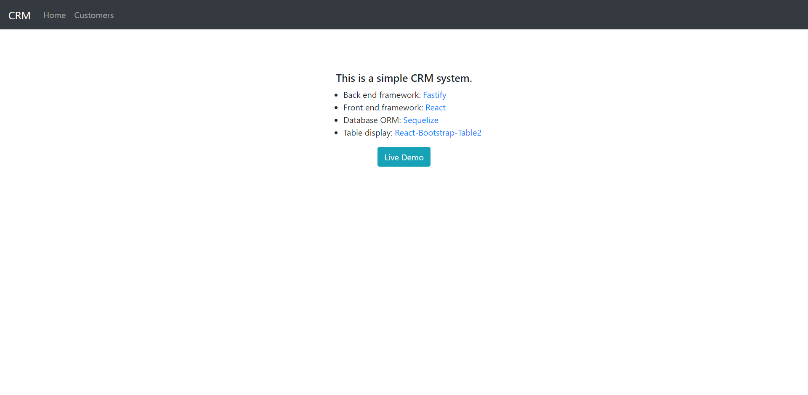
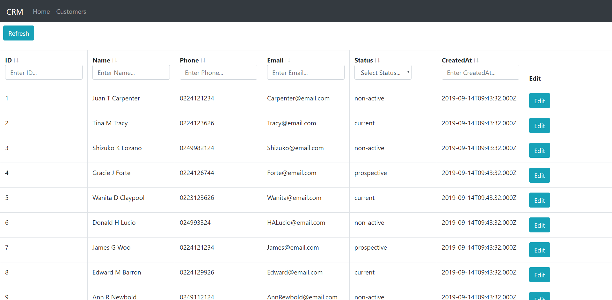
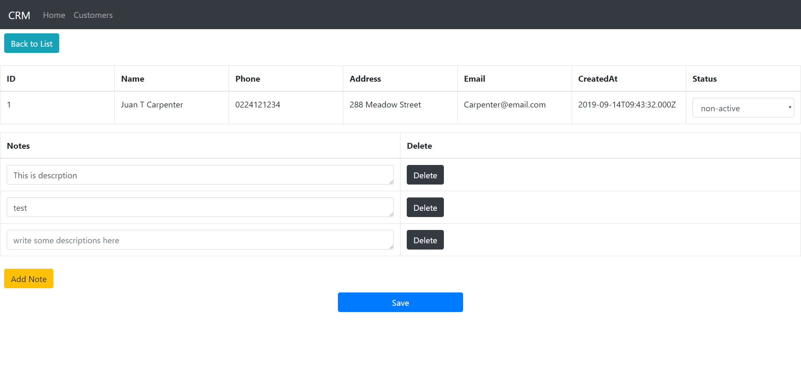

# simple-crm

A simple CRM built with [Fastify](https://github.com/fastify/fastify) and [React](https://github.com/facebook/react).

-   Test data is auto generated when the server boots up.
-   Each customer has `id`, `name`, `phone`, `address`, `email`, `status`, `createdAt` and can have any number of `notes`.
-   Click `Edit` button to edit customer's `status` and `note` (add/modify/delete).
-   Using the header column to filter or sort the customer list.

## Main files

-   Schemas: [Customer](./server/models/customer.js), [CustomerNote](./server/models/customerNote.js)
-   [Server Routes](./server/services/customer/index.js)
-   [Customer List Page](./src/containers/customer/list.js)
-   [Customer Detail Page](./src/containers/customer/detail.js)
-   [Redux](./src/modules/customer.js)

## Prerequisite

-   Node.js 10.x+
-   Yarn 1.17+
-   MariaDB 10.x+

## Demo

## Run

### Run server

`yarn start-server`

### Run front end

`yarn start`

## Test

### Run test for server

`yarn test-server`

### Run test for front end

`yarn test`

## Build

### Front end

`yarn build`

## Misc

First time to try [Fastify](https://github.com/fastify/fastify), [Sequelize](https://github.com/sequelize/sequelize) and [React Hooks](https://reactjs.org/docs/hooks-intro.html).
